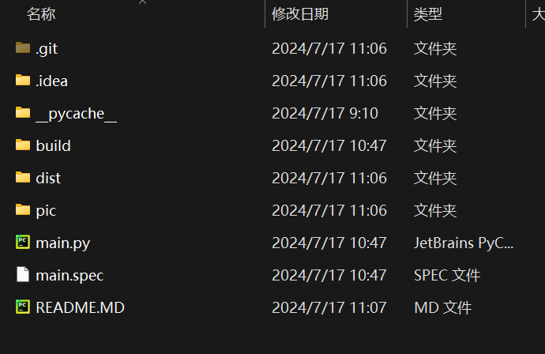
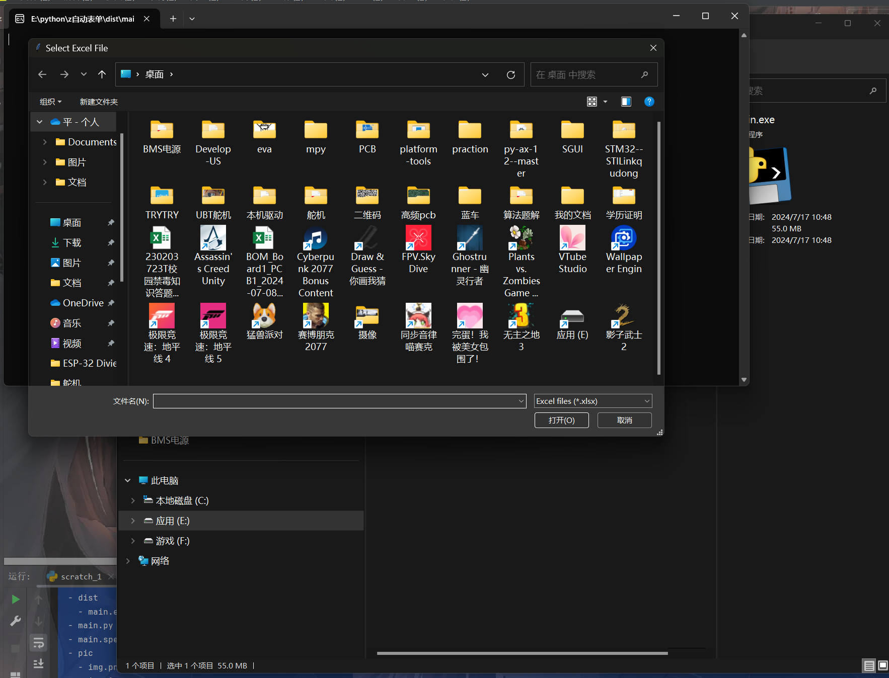
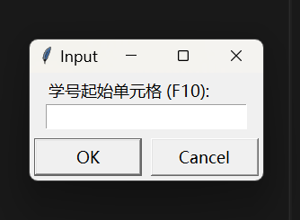

# 自动化填写表单 东北电力大学自动化


## 1.在哪里用？
- 像以上的数据，不需要一一复制，只需要这个小脚本便可以轻松输入每一个人的学号和操行

## 2.怎么用？
- 首先下载该文件夹，解压之后得到一个文件夹,文件夹中的东西如下
- 

- ```
  - z自动表单
    - .git
    - .idea
    - README.MD
    - __pycache__
    - build
    - dist
      - main.exe
    - main.py
    - main.spec
    - pic
   
     ```
- ## 首先一定要提前建好表格！！
- 双击打开位于dist文件中的<b>main.exe</b>文件
- - 首先弹出一个命令行窗口，<b>一定不要关掉！！！！！！！</b>这是程序运行的主窗口，打印出来的信息都在这里 
  - 紧接着弹出文件选择窗口，选择要进行操作的文件，
  - 选择好文件后进行下一步，这里输入学号起始单元格<b>例如：F10,一定要大写</b>
  - ok之后输入学号结束单元格
  - 之后输入操行分起始单元格一定是与学号的单元格同一行!比如学号起始F10，输入操行分起始单元格I10
  - 最后输入操行分结束单元格
  - 然后打开你建好的表
  - 双击第一位的输入框
  - 等待一小会儿
  - 再次双击第二位的输入框
## 切记在输入过程中不能鼠标双击其他位置，否则直接提交！！！！！，本人概不负责！！！
